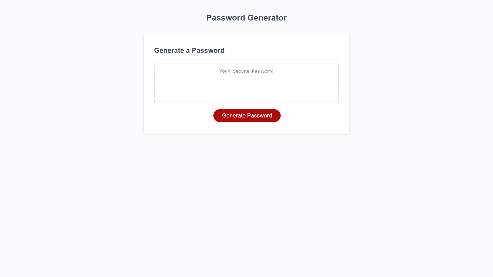

# Password Generator!

#### This Week's Bootcamp Odd-Number Challenge: 
Our assignment for Week Three is to take an already-established code and adjust it to make a working Password Generator.

## Link To Website
[Click here to be re-directed!](https://callbeyond.github.io/PasswordGenerator/ "Click here to generate a password!")

## Usage
Click generate password, read and answer the prompts, and bam! Your newly, randomized password is complete.  

## Screenshots

## Credits

UofM-VIRT-FSF-PT-10-2023-U-LOLC-ENTG
## License

[MIT](https://choosealicense.com/licenses/mit/)

